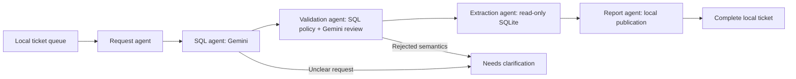

# Bank-AI-Project

A runnable Gemini-assisted workflow for local ad-hoc bank reports. A business user
submits plain English, agents generate and validate SQL, read the customer and
transaction tables, and publish a local HTML/CSV/JSON report. The local ticket is
completed only after the complete report bundle is published.

This version uses **fictional sample data and a persistent local queue**. It does
not connect to a bank, external ITSM system, email service, or report portal.

## Quick start

Python 3.11 or newer is required. From this repository directory:

```bash
python3 -m venv .venv
source .venv/bin/activate
python -m pip install -e '.[dev]'
cp .env.example .env
```

Edit `.env` locally and set `GEMINI_API_KEY` to your Google AI Studio Gemini key.
The file is ignored by Git. Existing environment variables override `.env`.
`GEMINI_MODEL` defaults to `gemini-3.8-flash`; set it to a compatible model that
your key can access. This uses Google's `google-genai` SDK and structured JSON
output. See the [Google API reference](https://ai.google.dev/api/generate-content).
Keys can be created in [Google AI Studio](https://aistudio.google.com/apikey).
Eligible models have a limited [free tier](https://ai.google.dev/gemini-api/docs/pricing).

Create the sample database (once), submit a request, and process it:

```bash
bank-agent init-demo
bank-agent submit "Show each customer's ID, name, and total completed transaction amount in EGP for September 2026, only customers whose total is more than 5000 EGP, highest total first."
bank-agent run --max-tickets 1
bank-agent tickets
```

`python -m Adhoc_agent` can replace `bank-agent` in every command. The executable
prints the ticket state and absolute report directory. Open `report.html` in that
directory to inspect the result. Expected sample results:

| customer_id | full_name | total_egp |
| --- | --- | --- |
| 2 | Demo Customer B | 14000.0 |
| 1 | Demo Customer A | 7500.0 |

For another request:

```bash
bank-agent submit "List customer names and cities with their completed EGP debit transactions in September 2026. Include transaction ID, date and amount in EGP, ordered by date."
bank-agent run --max-tickets 1
```

The second example is a live natural-language request, not an offline fixture.
Results depend on Gemini generation and semantic review, followed by the local
SQL checks. Tickets rejected as ambiguous retain the reason for clarification.

## Offline demo

```bash
bank-agent demo
```

No API key or API call is needed. This runs exactly one fixed request with a
predefined SQL plan, using a separate database/queue/report directory under
`runtime/offline-demo/`. It exercises all five stages and is labeled as an offline
fixture in the report. It cannot translate arbitrary English. It does not consume
real pending tickets or change the main bank database.

## Agents and workflow



| File | Responsibility |
| --- | --- |
| `Adhoc_agent/agents/request_agent.py` | Atomically claim the oldest pending request. |
| `Adhoc_agent/agents/sql_agent.py` | Generate one parameterized SQLite SELECT from the request and schema. |
| `Adhoc_agent/agents/validation_agent.py` | Enforce SQL policy, compile against the schema, and independently ask Gemini whether the SQL satisfies the request. |
| `Adhoc_agent/agents/extraction_agent.py` | Execute the validated query with database, time and row limits. |
| `Adhoc_agent/agents/report_agent.py` | Publish HTML, CSV, JSON, and audit metadata locally. |
| `Adhoc_agent/workflows/adhoc_workflow.py` | Order the stages and record completed, failed, or clarification states. |

The report stage is deterministic: it publishes actual extracted rows and the
review reason. It does not send results to Gemini or invent a narrative summary.

## Tables and business definitions

The bank database has two tables. Ticket state lives in a separate `tickets.db`.

| Table | Columns |
| --- | --- |
| `customer` | `customer_id`, `full_name`, `city`, `segment`, `created_at` |
| `"transaction"` | `transaction_id`, `customer_id`, `amount_minor`, `currency`, `transaction_type`, `status`, `transaction_date` |

`transaction.customer_id` references `customer.customer_id`. The transaction table
name must be quoted because it is a SQL keyword. Sample data includes completed,
failed, and pending transactions, EGP and USD, transactions outside September,
and a customer with no transactions.

Money is stored as integer minor units: `amount_minor / 100.0` gives the major
currency amount. Monetary SUM/AVG queries must group by currency or filter one
currency. No FX rates or balances are available. Dates use ISO `YYYY-MM-DD` in
UTC; month filters use an inclusive start and exclusive end. Totals default to
completed transactions. Credits and debits are separate transaction categories.

## Validation and failure behavior

- One SELECT over the approved tables and columns; explicit columns, with
  `COUNT(*)` permitted. INNER/LEFT joins must require the customer foreign key.
- Named bound parameters for model-generated filters. No writes, schema reads,
  cross joins, subqueries, CTEs, unions, window functions, or unapproved functions.
- SQL AST validation plus SQLite read-only mode, `query_only`, and an authorizer.
  SQLite compilation catches missing/ambiguous columns before semantic review.
- Two generation calls at most per ticket: SQL generation, then semantic review.
  Unsafe SQL or clarification stops before the second call. The SDK has a 30-second
  timeout per call, one attempt, and no automatic retries.
- `BANK_MAX_ROWS` defaults to 10,000. Results exceeding the cap fail with an explicit
  error; no silently truncated report is published. SQL limits explicitly requested
  by the user are checked by the semantic reviewer.
- `BANK_QUERY_TIMEOUT_SECONDS` defaults to 5. Duplicate report column names are
  rejected. Empty valid results publish headers and a "No matching records" message.
- Reports are staged and published together. HTML is escaped and CSV text cells
  are protected against spreadsheet formula execution. The raw JSON preserves values.
- Request text, schema, SQL and bindings go to Gemini. Extracted database rows
  stay local. Do not include confidential data in requests without approval for
  sending it to the configured provider.

Gemini's semantic review is a best-effort automated check. The local controls
enforce access and query limits; neither proves that a real banking report has
received business approval or production acceptance.

Tickets transition `pending -> in_progress -> completed | failed | needs_clarification`.
Failures preserve an error and stage trace and do not mark the ticket completed.
After correcting configuration, explicitly retry a failed ticket:

```bash
bank-agent retry TICKET_ID
bank-agent run --max-tickets 1
```

For an ambiguous request, submit a new, clarified request. Processing up to a
bounded number of pending tickets is supported with `run --max-tickets N` (1..100,
default 1). There is no background polling or scheduled API spend. Concurrent
workers cannot claim the same ticket. A hard process kill may leave a ticket
`in_progress`; automatic reclaim/retry is deliberately absent. Ctrl-C during a
claimed workflow marks it failed when SQLite remains available.

Runtime defaults to `./runtime/`. Override with `BANK_RUNTIME_DIR` in `.env` or put
`--runtime /absolute/path` **before** the CLI subcommand. Sample initialization
refuses to overwrite an existing database.

## Report files

Each completed ticket has an immutable directory under `runtime/reports/`:

- `report.html`: request, table, review reason, downloadable files, SQL/parameters.
- `data.csv`: Excel-compatible UTF-8 CSV.
- `data.json`: exact column list and row values.
- `metadata.json`: ticket ID, timestamp, model, SQL, bindings, explanation,
  validation, row count, stage trace, and SHA-256 hashes of the three other files.

No API keys are included in reports. Treat runtime files as private local data.

## Verification

```bash
pytest -q
ruff check .
ruff format --check .
```

The automated suite uses synthetic SQLite data and model stubs; no keys or API
spending are required. It verifies expected join totals, currency/date/status
boundaries, LEFT JOIN behavior, unsafe SQL rejection, bound-value injection,
timeouts, row overflow, empty results, atomic claims/publication, report integrity,
escaping, and provider failures. GitHub Actions is configured for Python 3.11-3.13.

Connecting real systems requires an approved ITSM adapter, the real database
dialect/schema and restricted read-only credentials, and a report destination
with permission to publish and close external tickets. Replace the local queue
and database tools only after those details are supplied.
